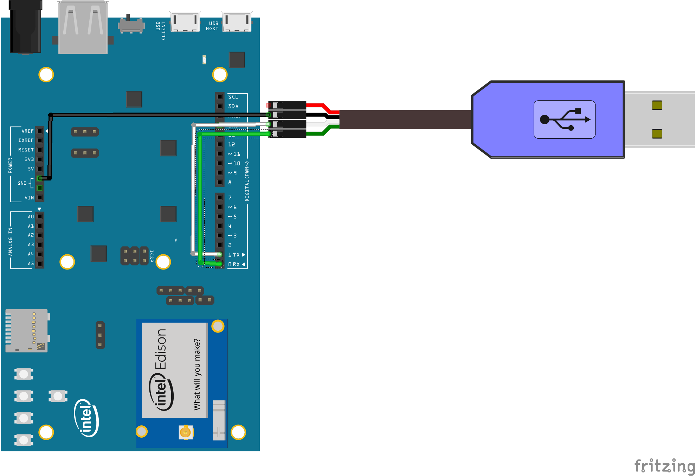
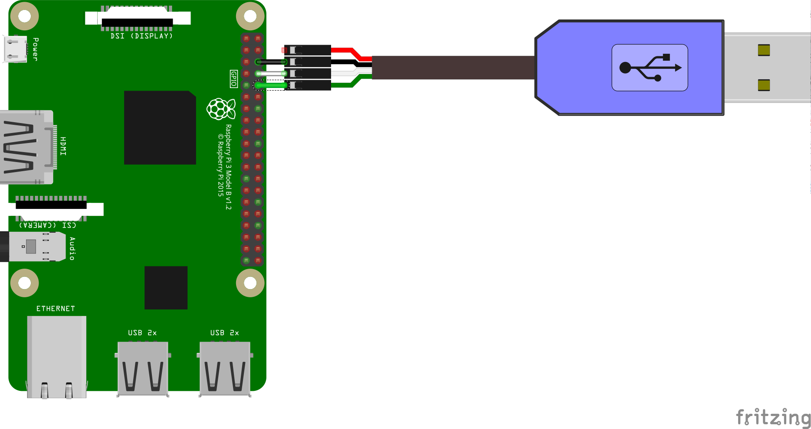

UART Loopback sample for Android Things
=======================================

This sample demonstrates basic data read and write operations over a UART.
The application creates a loopback interface that immediately echoes
any data read from the receive (RX) buffer to the transmit (TX) buffer.

Pre-requisites
--------------

- Android Things compatible board with an available UART port
- Android Studio 2.2+
- [FTDI TTL-232R](http://www.ftdichip.com/Products/Cables/USBTTLSerial.htm)
or compatible USB-TTL converter


Schematics
----------




NOTE: on Raspberry Pi 3 you need to disable the serial debugging console using
the following [instructions][pi3-instructions] in order for the driver to be
able to access the UART port.

Check in the USB TTL cable's documentation for the TX and RX wire colors:
- connect the cable TX wire to the board RX pin
- connect the cable RX wire to the board TX pin

Build and install
=================

1. On Android Studio, click on the "Run" button.

If you prefer to run on the command line, type

```bash
./gradlew installDebug
adb shell am start com.example.androidthings.loopback/.LoopbackActivity
```

2. Plug the USB-TTL converter into a host PC, start your favorite terminal
program (minicom, screen, RealTerm, etc.), and connect to the USB-TTL port
at 115200 baud.

3. Type characters into the terminal and observe them echo back to you from the device.


License
-------

Copyright 2016 The Android Open Source Project, Inc.

Licensed to the Apache Software Foundation (ASF) under one or more contributor
license agreements.  See the NOTICE file distributed with this work for
additional information regarding copyright ownership.  The ASF licenses this
file to you under the Apache License, Version 2.0 (the "License"); you may not
use this file except in compliance with the License.  You may obtain a copy of
the License at

  http://www.apache.org/licenses/LICENSE-2.0

Unless required by applicable law or agreed to in writing, software
distributed under the License is distributed on an "AS IS" BASIS, WITHOUT
WARRANTIES OR CONDITIONS OF ANY KIND, either express or implied.  See the
License for the specific language governing permissions and limitations under
the License.

[pi3-instructions]: https://developer.android.com/things/hardware/raspberrypi.html#disabling_the_console
